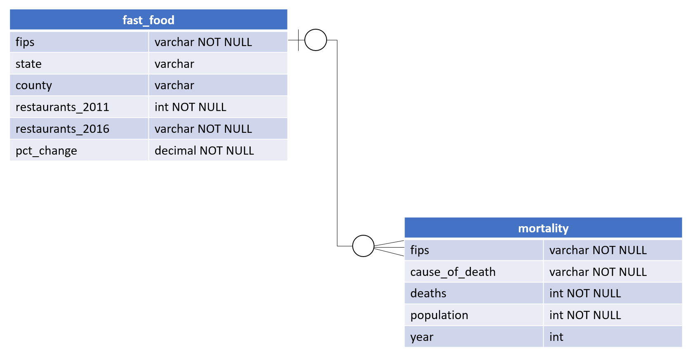

# County Health Dashboard
This repo was created for a Udacity Data Engineering course. This repo is my final project for that course.


<br/>

## Client
<p>The client folder holds all the front end code. <br/>
To get the front end up and running locally first cd into the folder
</p>

```
cd client
```
<p>Then run npm i</p>

```
npm i
```

<p>Then run npm start</p>

```
npm start
```

<br/>

## Server
<p>The server folder holds all the back end nodejs code. <br/>
To get the back end up and running locally first add a .env file to the server folder and add the below details
</p>

```
HOST="mydbendpoint"
DB_NAME="mydbname"
DB_USER="myuser"
DB_PASSWORD="mypassword"
DB_PORT=mydbport
```

<p>Next open a cmd prompt and cd into the folder</p>

```
cd server
```
<p>Then run npm i</p>

```
npm i
```
<p>Then run npm start</p>

```
npm start
```
<br/>

## Datapipeline
<p>The datapipeline folder holds all the code responsible for pulling data from the datapipeline/datasets folder into the AWSRDS Postgres DB<br/>
The fast food data came from usda.gov and can be seen here: https://www.ers.usda.gov/data-products/food-environment-atlas/go-to-the-atlas/<br/>
The mortality data came from the CDC wonder database and can be seen here: https://wonder.cdc.gov/Deaths-by-Underlying-Cause.html<br/>
The mortality data was too large and can't be uploaded to github so the etl.py file references only a subset of the original data.
<br/><br/>
If you want to run the datapipeline into your own AWS RDS DB you can follow the below steps:</p><br/><br/>

1. Add a rds.cfg file to the datapipeline/etl folder with the below details:
```
[DBCONNECT]
HOST=mydbendpoint
DB_NAME=mydbname
DB_USER=myuser
DB_PASSWORD=mypassword
DB_PORT=mydbport
```
2. Open a cmd prompt to the datapipeline folder and enter the below to setup your virtual environment
```
env_setup.cmd
```
3. Activate your virtualenvironment
```
env\scripts\activate
```
4. Run create_tables.py
```
python etl/create_tables.py
```
5. Run etl.py
```
python etl/etl.py
```

<br />

## ERD
 
 

 <br />

 ## How the Project Could be Altered

<br /> 

### If the data was increased by 100x.
If the data was increased by 100x then analysis would need to be done to make sure the current datapipeline can handle such an amount of data. Currently the dataset pulls around 2 million rows from the CDC database and transforms the datasets to around 80,000 rows. The datapipeline, backend, and UI are all extremely performant with this amount of data. If the data were increased by 100x we would also need to change the tech stack that handles the data. AWS Redshift is a datawarehouse product and is able to handle large datasets much better than a traditional database. We would need to implement AWS Redshift.
<br />

### If the pipelines were run on a daily basis by 7am.
If the pipelines were to be run on a daily basis at 7am the project would need to add Apache Airflow. After adding Airflow we could set up dags to run the data pipeline daily ay 7am.

<br />

### If the database needed to be accessed by 100+ people.
If the database needed to be accessed by 100+ people this would be easily possible as the database is currently AWS RDS. One thing we would need to be cognizant of if we went with this route is permissions - who do we want to be able to access what data? Or do we want all of our business users to be able to access all the data? These are questions we would work with our stakeholders to answer.

## Choice of Technologies and Tools
-> REACT: I chose react because I have experience with it and enjoy getting better at it. It also renders incredibly quickly which is perfect for a dashboard application.
-> NODEJS: I chose NodeJS because I have experience with it but am always trying to improve. NodeJS makes for a great reliable backend/server.
 -> PostgreSQL: I chose Postgres as a DB because we previously used it in the Data Engineering course and I knew it was capable of handling the amount of data for this dashboard (~80,000 rows). Postgres is a more traditional Relational Database which is what I had in mind for this project.
-> How often the data should be updated: The data in this project is intended to run once and only once. The data I gathered from the USDA on fast food restaurants is only available for the years 2011 and 2016. If someone wanted to run the data pipeline more consistently they would have to work with the USDA to get them to provide updated data on a consistent schedule. If the user wanted to they could however pull the mortality data in the database on a monthly or yearly schedule as the CDC updates there WONDER database frequently.