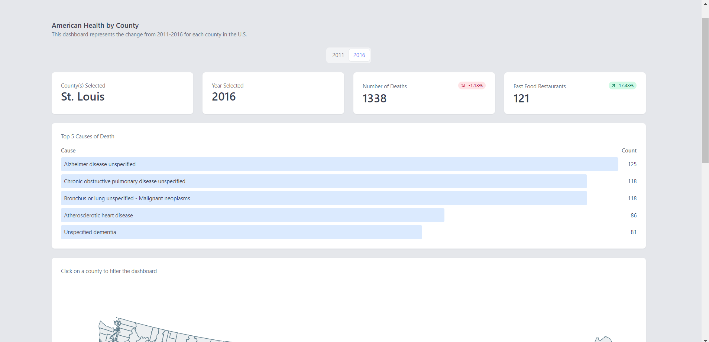

# County Health Dashboard
This repo was created for a Udacity Data Engineering course. This repo is my final project for that course.



<br/>

## Client
<p>The client folder holds all the front end code. <br/>
To get the front end up and running locally first cd into the folder
</p>

```
cd client
```
<p>Then run npm start</p>

```
npm start
```

<br/>

## Server
<p>The server folder holds all the back end nodejs code. <br/>
To get the back end up and running locally first add a .env file to the server folder and add the below details
</p>

```
HOST="mydbendpoint"
DB_NAME="mydbname"
DB_USER="myuser"
DB_PASSWORD="mypassword"
DB_PORT=mydbport
```

<p>Next open a cmd prompt and cd into the folder</p>

```
cd server
```

<p>Then run npm start</p>

```
npm start
```
<br/>

## Datapipeline
<p>The datapipeline folder holds all the code responsible for pulling data from the datapipeline/datasets folder into the AWSRDS Postgres DB<br/>
The fast food data came from usda.gov and can be seen here: https://www.ers.usda.gov/data-products/food-environment-atlas/go-to-the-atlas/<br/>
The mortality data came from the CDC wonder database and can be seen here: https://wonder.cdc.gov/Deaths-by-Underlying-Cause.html<br/>
The mortality data was too large and can't be uploaded to github so the etl.py file references only a subset of the original data.
<br/><br/>
If you want to run the datapipeline into your own AWS RDS DB you can follow the below steps:</p><br/><br/>

1. Add a rds.cfg file to the datapipeline/etl folder with the below details:
```
[DBCONNECT]
HOST=mydbendpoint
DB_NAME=mydbname
DB_USER=myuser
DB_PASSWORD=mypassword
DB_PORT=mydbport
```
2. Open a cmd prompt to the datapipeline folder and enter the below to setup your virtual environment
```
env_setup.cmd
```
3. Activate your virtualenvironment
```
env\scripts\activate
```
4. Run create_tables.py
```
python etl/create_tables.py
```
5. Run etl.py
```
python etl/etl.py
```